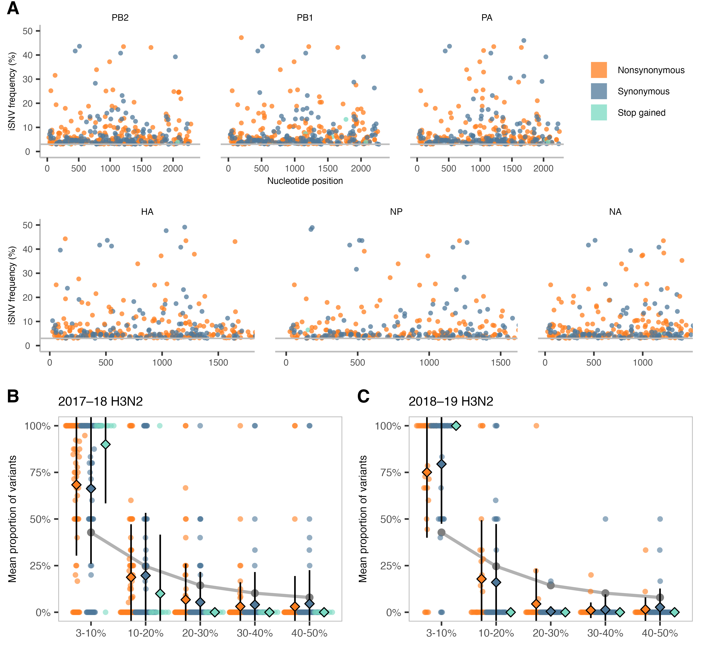

# Weak selection and stochastic processes limit the emergence of antigenic variants during household transmission of influenza A viruses
Specific files in this repository have been redacted to protect sensitive identifiers.

## Abstract
Influenza viruses undergo antigenic drift, the gradual accumulation of mutations that cause antigenic changes in the viral surface proteins hemagglutinin (HA) and neuraminidase (NA). Although selection for antigenic variants is detectable on the global scale, the processes by which antigenic variants are generated and selected in individual hosts remain unclear. It has been hypothesized that selection for antigenic variants may occur during the establishment of a new infection, rather than over time in a single host. Here, we leveraged a large household cohort study to assess whether selection was detectable between acutely infected hosts. We investigated influenza A virus evolution using specimens from 384 children and household contacts with RT-PCR-confirmed influenza A infection, representing infections with A(H1N1)pdm09 and A(H3N2) viruses from 2017–19. In agreement with prior studies, we found that acute infections involved weak purifying selection across the viral genome. In addition, we identified 40 transmission events occurring in 31 households. During transmission, evolution between hosts was characterized by tight transmission bottlenecks and weak purifying selection. We found variability in the strength and direction of selection on antigenic regions of HA, but no clear evidence for selection of antigenic variants during transmission. Together, our results indicate that stochastic processes and weak natural selection dominate most acute influenza A virus infections and transmission events, and that selection of antigenic variants during transmission between acutely infected hosts is likely to be exceedingly rare.

## Example figure

